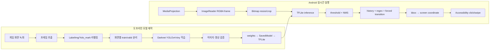

# Gamebot 온디바이스 비전 자동화 플랫폼 — 대표 앱 SK2

게임 화면에서 버튼과 상태를 객체로 탐지하고, 직전 화면과 최근 탐지 이력을 함께 판단해 클릭·스와이프를 실행하는 Android 자동화 프로젝트입니다. 이 저장소는 세븐나이츠2용 앱 셸이며, 실제 시스템은 공용 Android 런타임, 데이터셋 도구, Darknet 학습 설정과 여러 게임별 앱으로 나뉘어 있습니다.

단순히 탐지 점수가 가장 높은 객체를 클릭하지 않습니다. 화면마다 여러 객체가 동시에 나타나고 같은 버튼이 서로 다른 상태에 재사용되는 문제를 해결하기 위해 클래스별 임계값, NMS, 시간축 안정화, 객체 조합 규칙, 직전 액션 기반 강제 전이와 연속 클릭 억제를 결합했습니다.

> 이 저장소는 2020~2021년 개발 당시의 역사적 소스입니다. 현재 공개본만으로 완전한 빌드나 학습 재현을 보장하지 않으며, 아래에서 확인 가능한 구현과 한계를 구분해 설명합니다.

## 목적과 사용 환경

- 목적: 반복적인 게임 UI 흐름을 루팅 없이 화면 인식으로 자동화
- Android: Kotlin, minSdk 25, targetSdk 30
- 화면 입력: `MediaProjection` → `VirtualDisplay` → `ImageReader`
- 온디바이스 추론: TensorFlow Lite 2.4, YOLOv4-tiny 계열
- 액션 출력: `AccessibilityService.dispatchGesture()` 기반 click/swipe
- 실행 형태: foreground service와 이동 가능한 overlay
- 주 사용 환경: 실제 Android 기기 또는 BlueStacks의 가로 화면
- 확인된 제약: 당시 README 기준 Nox에서는 화면 캡처가 동작하지 않았음
- 학습 환경: Ubuntu, Darknet, Python, Yolo_mark, LabelImg, OpenCV; 일부 Dockerfile은 환경 준비용
- 외부 연동: AdMob, 역사적 SK2 버전의 Kakao 로그인·나에게 보내기 알림
- 클라우드: **AWS를 사용하지 않았습니다.** 추론은 서버 호출이 아닌 기기 내부에서 수행했습니다.

현재 SK2 설정은 448×448 모델 입력을 사용합니다. [Gradle 모델 설정](https://github.com/cheolgyu/gamebot-app-sk2/blob/main/gradle.properties)과 [Android release 설정](https://github.com/cheolgyu/gamebot-app-sk2/blob/main/app/build.gradle)에서 확인할 수 있습니다.

## 저장소 구성

| 저장소 | 역할 |
|---|---|
| [`gamebot-app-sk2`](https://github.com/cheolgyu/gamebot-app-sk2) | 대표 앱. 패키징, 화면 안내, 모델 입력 설정 |
| [`gamebot-common-background`](https://github.com/cheolgyu/gamebot-common-background) | 화면 캡처, foreground service, TFLite 추론, 상태·액션 선택, overlay, 접근성 gesture |
| [`gamebot-dataset`](https://github.com/cheolgyu/gamebot-dataset) | 녹화 영상 프레임 추출, 라벨 생성·정리, train/valid manifest 생성 |
| [`gamebot-yolo`](https://github.com/cheolgyu/gamebot-yolo) | Darknet YOLO 설정, 학습 manifest, 검증 및 TFLite 변환 절차 |
| [`gamebot-app-baram`](https://github.com/cheolgyu/gamebot-app-baram) | 바람의나라: 연용 앱 어댑터 |
| [`gamebot-app-gotgl`](https://github.com/cheolgyu/gamebot-app-gotgl) | 왕좌의게임: 윈터이즈커밍용 앱 어댑터 |
| [`gamebot-app-stoneage`](https://github.com/cheolgyu/gamebot-app-stoneage) | 스톤에이지용 앱 어댑터 |

게임별 `MainActivity`는 공용 `MediaProjectionActivity`를 상속하고, 앱별 모델·입력 크기·라벨 정책을 바꾸는 구조입니다. 초기에는 TensorFlow Object Detection API의 SSD MobileNet도 실험했으나, 작은 UI 객체 인식을 위해 YOLOv4-tiny 계열로 전환했습니다.

## 전체 데이터 흐름



## 오프라인 ML 파이프라인

1. BlueStacks 등에서 실제 플레이 화면을 녹화했습니다.
2. Yolo_mark의 `cap_video` 또는 OpenCV 스크립트로 영상을 프레임 이미지로 분리했습니다. 반복 프레임을 줄이기 위해 문서상 10프레임 간격 추출도 사용했습니다.
3. LabelImg/Yolo_mark로 객체를 라벨링했습니다. 위치가 고정된 UI는 Python 스크립트로 동일 좌표 라벨 생성을 보조했습니다.
4. 화면 종류별 디렉터리를 만들고 각 디렉터리에서 약 10%를 validation manifest로 분리했습니다.
5. Darknet의 YOLOv4-tiny 설정과 사전학습 weight로 학습하고 `-map` 옵션, 이미지·동영상 detector로 결과를 확인했습니다.
6. `tensorflow-yolov4-tflite` 도구를 이용해 Darknet weights를 TensorFlow SavedModel로 바꾼 뒤 TFLite로 변환했습니다.
7. FP16과 INT8 변환도 실험했으며, Android에는 게임별 모델과 라벨 정책을 assets로 패키징했습니다.

tracked manifest 기준 SK2 p7은 29개 클래스, train 6,636개 항목, validation 751개 항목입니다. 이는 저장소에 남은 manifest 줄 수이며 원본 이미지 전체나 고유 이미지 수를 의미하지 않습니다.

- [SK2 데이터 분류와 라벨 정의](https://github.com/cheolgyu/gamebot-dataset/blob/master/README.md)
- [화면별 90:10 manifest 생성 스크립트](https://github.com/cheolgyu/gamebot-dataset/blob/master/yolo/label_after2.py)
- [학습·검증·TFLite 변환 절차](https://github.com/cheolgyu/gamebot-yolo/blob/master/Readme.md)
- [SK2 p7 학습 설정](https://github.com/cheolgyu/gamebot-yolo/blob/master/cfg/sk2_p7.cfg)
- [SK2 p7 train manifest](https://github.com/cheolgyu/gamebot-yolo/blob/master/workspace/sk2/p7/train.txt)
- [SK2 p7 validation manifest](https://github.com/cheolgyu/gamebot-yolo/blob/master/workspace/sk2/p7/valid.txt)

## Android 런타임 흐름

1. 사용자가 overlay, 화면 캡처, 접근성 gesture 권한을 승인합니다.
2. [`MediaProjectionActivity`](https://github.com/cheolgyu/gamebot-common-background/blob/master/src/main/java/com/highserpot/background/MediaProjectionActivity.kt)가 foreground service를 시작합니다.
3. [`BackgroundServiceMP`](https://github.com/cheolgyu/gamebot-common-background/blob/master/src/main/java/com/highserpot/background/service/BackgroundServiceMP.kt)가 실제 화면 크기로 `VirtualDisplay`와 RGBA `ImageReader`를 구성합니다.
4. [`BackgroundService`](https://github.com/cheolgyu/gamebot-common-background/blob/master/src/main/java/com/highserpot/background/service/BackgroundService.kt)가 한 프레임을 Bitmap으로 만들고 추론 루프를 직렬 실행합니다.
5. [`Run`](https://github.com/cheolgyu/gamebot-common-background/blob/master/src/main/java/com/highserpot/tf/tflite/Run.kt)이 프레임을 모델 입력 크기로 변환하고, 탐지 좌표를 다시 원본 화면 좌표로 매핑합니다.
6. [`YoloV4Classifier`](https://github.com/cheolgyu/gamebot-common-background/blob/master/src/main/java/com/highserpot/tf/tflite/YoloV4Classifier.kt)가 TFLite 추론, 클래스별 threshold와 IoU 0.6 NMS를 수행합니다. 공개 HEAD 기준 CPU 4 threads이며 NNAPI/GPU delegate는 비활성입니다.
7. [`Target`](https://github.com/cheolgyu/gamebot-common-background/blob/master/src/main/java/com/highserpot/tf/Target.kt)이 최근 탐지 이력과 화면 규칙으로 실제 액션 대상을 정합니다.
8. bbox 중심점을 화면 좌표로 바꾸고, 이동 가능한 overlay 영역에 포함되면 클릭을 차단합니다.
9. [`TouchService`](https://github.com/cheolgyu/gamebot-common-background/blob/master/src/main/java/com/highserpot/background/service/TouchService.kt)가 100ms gesture로 click 또는 swipe를 실행합니다.

## 화면 상태와 액션 선택

객체 탐지만으로는 현재 화면을 확정할 수 없었습니다. 예를 들어 `홈` 버튼은 가방 기본 화면, 분해 선택 화면, 분해 이후 화면에 모두 나타납니다. 같은 객체를 상황에 따라 다르게 처리하기 위해 다음 계층을 추가했습니다.

- **클래스별 confidence**: 작은 버튼과 큰 팝업에 서로 다른 최소 점수를 적용
- **다중 객체 regex**: 한 프레임에 검출된 ID 조합으로 화면과 우선 액션 결정
- **시간축 안정화**: 최근 탐지 목록이 반복해서 일치해야 유효 상태로 채택
- **추론시간 연동**: 고정된 sleep 대신 실제 `lastProcessingTimeMs`를 history window 계산에 사용
- **강제 상태 전이**: 직전 액션이 확인되면 다음 화면에서 우선할 객체를 지정
- **연속 클릭 억제**: UI가 갱신되기 전에 같은 bbox를 반복 클릭하는 것을 제한

SK2 분해 후 복귀 흐름은 다음 전이를 사용했습니다.

```text
분해 결과(11) → 홈(0) → 메뉴(24) → 절전모드(25)
```

관련 구현 변화:

- [추론 속도에 history 유지시간을 맞춘 변경](https://github.com/cheolgyu/gamebot-common-background/commit/cd4eccd9e013a0d0547569942ea41bb29402d74a)
- [`ScreenHistory`를 `Target` 액션 선택기로 재구성](https://github.com/cheolgyu/gamebot-common-background/commit/f7c2b89d3832b25bc2f52953008dfb3c86c7d311)
- [지속적 클릭 오류 수정](https://github.com/cheolgyu/gamebot-common-background/commit/dbd5b0bc264ed80262bb8fcfc4f72fc3d691a35b)

## 대표 기능

구현 코드와 앱 안내에서 확인되는 SK2 기능입니다.

- 스마트키가 꺼진 상태를 탐지해 다시 활성화
- 스킵 화면과 확인 팝업 처리
- 도움 팝업 닫기와 팀 변경 진행
- 기본 화면 또는 절전 화면의 인벤토리 가득 참 탐지
- 일반·고급 장비 선택, 분해 실행, 확인 팝업과 결과 처리
- 분해 완료 후 홈 → 메뉴 → 절전모드 복귀
- 분해 실행 횟수 overlay 표시
- 탐지 사각형과 실제 클릭 지점 overlay 표시
- 역사적 SK2 버전에서 귀환·대기 상태의 Kakao 나에게 보내기 알림

과거 메모에 있는 펫 액티브 스킬, 일일 던전 전체 자동화, 이메일 알림 등은 구현 완료 근거가 충분하지 않아 현재 기능으로 주장하지 않습니다. 원래의 설계·실험 기록은 [`docs/legacy-sk2-notes.md`](docs/legacy-sk2-notes.md)에 보존했습니다.

## 주요 병목과 해결

| 문제 | 원인 | 적용한 변경 | 근거 |
|---|---|---|---|
| 캡처→추론 지연과 불필요한 I/O | 초기에는 Bitmap을 JPEG로 저장한 뒤 다시 읽어 TFLite에 전달 | 파일 저장·재로딩·삭제를 제거하고 Bitmap을 직접 전달 | [2020-12-12 변경](https://github.com/cheolgyu/gamebot-common-background/commit/2ca2360d9112a9070918f9daed87a3b255e3d188) |
| 작은 UI 객체와 지연의 trade-off | 입력 크기를 줄이면 빨라지지만 작은 버튼을 놓침 | 게임별 416~960 입력을 실험하고 SK2는 최종적으로 448 설정 사용 | [SK2 실험 기록](docs/legacy-sk2-notes.md), [GOTGL 416→960 변경](https://github.com/cheolgyu/gamebot-yolo/commit/b253ec8a0bbf1a3b09a4a433d30c4f2239547258) |
| 처리 중 프레임 누적 | 추론 속도보다 캡처가 빠를 수 있음 | `ImageReader`의 buffer를 1장으로 제한하고 추론 루프를 직렬화 | [2020-11-19 변경](https://github.com/cheolgyu/gamebot-common-background/commit/824522903082ce5492c9c5192726fcf430131570) |
| 오래된 화면에 대한 연속 클릭 | 탐지 완료 시점에는 게임 화면이 이미 전환 중일 수 있음 | 실제 추론시간 기반 history, 반복 탐지 확인, action debounce, 강제 전이 적용 | [`Target.kt`](https://github.com/cheolgyu/gamebot-common-background/blob/master/src/main/java/com/highserpot/tf/Target.kt) |
| 화면 회전 후 캡처·좌표 불일치 | display 해상도와 좌표 변환이 이전 방향 기준으로 남음 | 회전 감지 후 VirtualDisplay와 ImageReader를 재생성하고 변환행렬 재구성 | [2020-12-04 변경](https://github.com/cheolgyu/gamebot-common-background/commit/650f46e00e68af76e8d70c0489f581ddd6683f94) |
| 서비스 종료 후 리소스 잔류 | 추론 thread, interpreter, projection과 overlay가 함께 정리되지 않음 | thread 중단 및 TFLite, ImageReader, VirtualDisplay, MediaProjection, receiver, view 명시적 해제 | [2020-12-23 변경](https://github.com/cheolgyu/gamebot-common-background/commit/c61c340b04b45c9de2c6ed3f5f44844424721790) |
| 모델·CPU 부담 | 큰 입력과 과도한 interpreter thread | FP16 모델로 교체하고 threads를 10에서 4로 조정 | [2021-01-05 변경](https://github.com/cheolgyu/gamebot-common-background/commit/b942b1c4abad4faef2ef9b586da8803e0a54419e) |
| overlay 자체를 오탐 클릭 | 탐지 좌표가 움직이는 광고·제어 overlay와 겹침 | overlay의 현재 화면 영역을 계산해 영역 내부 gesture 차단 | [2020-12-05 변경](https://github.com/cheolgyu/gamebot-common-background/commit/191e1703de484f27325083a8e7345cc2bfab7a93) |

개발 메모에는 640 입력의 탐지가 약 0.6~1초였고 416은 더 빠르지만 작은 객체를 놓쳤다고 기록되어 있습니다. 이는 당시 개발 환경의 관찰값이며 현재 재현한 벤치마크가 아니므로 성능 보장 수치로 사용하지 않습니다. FP16과 thread 조정도 전후 측정 로그가 없어 개선률을 주장하지 않습니다.

## 빌드·배포와 CI/CD

- Android release build는 로컬 Gradle, 별도 `keystore.properties`, 코드 난독화·최적화와 resource shrink를 사용했습니다.
- 앱 버전은 SK2 공개 HEAD 기준 `versionCode 17`, `versionName 1.17`입니다.
- 학습과 모델 변환은 로컬 명령과 Python/Shell 스크립트를 순서대로 실행했습니다.
- `gamebot-yolo`의 Dockerfile은 개발 환경 준비용이며 배포 pipeline이 아닙니다. 문서에는 실제 학습을 Ubuntu에서 실행했다고 기록되어 있습니다.
- 관련 공개 저장소에는 GitHub Actions workflow가 없습니다.
- Android 테스트는 프로젝트 생성 시 포함된 예제 수준이며 상태 제어와 추론 pipeline을 검증하는 자동화 테스트는 없습니다.
- 따라서 **자동 CI/CD를 구축했다고 주장하지 않습니다.** 당시 배포는 로컬 서명 build와 Google Play 수동 업로드 방식이었습니다.
- AWS 기반 build, 배포, 추론 또는 저장소 구성은 사용하지 않았습니다.

## 증거와 재현 한계

확인 가능한 근거:

- 2020-06부터 2021-03까지 이어지는 앱·공용 엔진·데이터·학습 저장소의 커밋 기록
- MediaProjection → Bitmap → TFLite → 상태 판단 → Accessibility gesture의 코드 경로
- SK2 29개 클래스의 YOLO 설정과 train/validation manifest
- 입력 크기, NMS, per-label threshold, FP16과 thread 수 변경 기록
- 디스크 I/O, 회전, 연속 클릭, 리소스 해제 문제를 수정한 커밋 diff
- 여러 게임 앱이 같은 공용 runtime을 사용한 모듈 구조

현재 공개본의 한계:

- 이 앱의 `settings.gradle`은 공용 모듈을 참조하지만 저장소에 `.gitmodules`와 해당 모듈 checkout이 없습니다.
- SK2 TFLite 모델과 학습 원본 이미지 전체는 공개 저장소에 포함되어 있지 않습니다.
- signing key와 `keystore.properties`는 의도적으로 공개하지 않습니다.
- 모델 weight, 데이터 원본과 정확한 의존성 snapshot이 완전하지 않아 fresh clone만으로 동일 모델을 재학습할 수 없습니다.
- train/validation은 화면 디렉터리 안의 프레임을 무작위 분리하므로 같은 녹화의 유사 프레임이 양쪽에 포함됐을 가능성이 있습니다.
- 과거 커밋 메시지에 적힌 `mAP 96%`, `99%`는 평가 로그와 데이터 snapshot이 없어 공식 성능 수치에서 제외합니다.
- 결제 화면처럼 오탐 비용이 큰 영역은 앱 안내에서도 자동화를 중지하도록 경고했습니다.

## 단독 개발 범위

관련 저장소의 Git 기록은 동일 작성자 1명의 커밋으로 구성되어 있습니다. 직접 설계·구현한 범위는 다음과 같습니다.

- 게임 화면 수집부터 라벨 정리, 학습 manifest 생성과 모델 변환을 연결한 작업 흐름
- 공용 Android 화면 캡처·overlay·추론·gesture runtime 통합
- 객체 조합과 이전 상태를 반영하는 액션 선택 로직
- SK2를 포함한 게임별 라벨, 모델 설정과 자동화 흐름
- 실제 기기·에뮬레이터에서 발견한 지연, 회전, 중복 클릭과 종료 누수 문제 수정
- 로컬 release build와 Play 배포

Darknet, TensorFlow Lite, `tensorflow-yolov4-tflite`, LabelImg, Yolo_mark와 Android/TFLite 예제 코드는 외부 오픈소스를 사용·수정·통합한 것이며 해당 프로젝트 자체를 직접 개발했다고 주장하지 않습니다. 게임과 게임 UI 자산의 소유권도 각 원저작자에게 있습니다.

---

이 README는 완성된 제품 문서가 아니라, 공개 Git 기록으로 확인 가능한 설계·구현·한계를 함께 남기는 engineering case study입니다.
